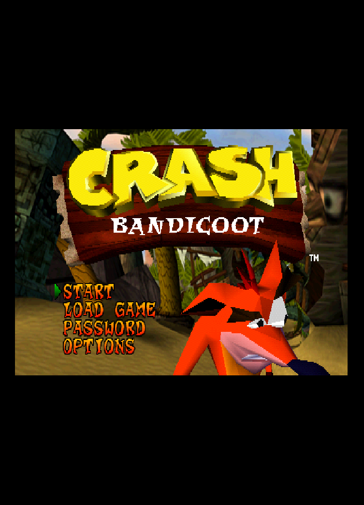
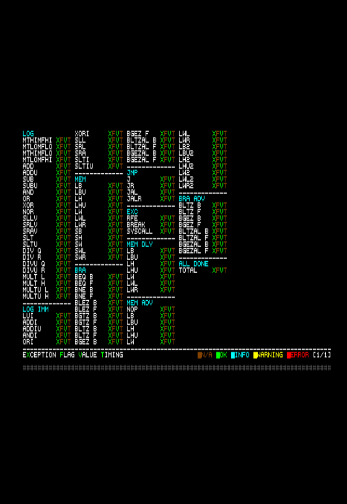

# cupid-ps1

A PlayStation 1 emulator written in C11. Linux-only. SDL2 frontend.

---

## Screenshots

<p align="center">
  
  
  
</p>

---

## Status

- **CPU**: interpreter, cached interpreter, and recompiler. The x86-64 recompiler backend is the actively-developed path. An AArch64 backend exists in tree but is scaffold-only; per-op codegen, fastmem, icache, and PGXP hooks all stub out to a per-block interpreter fallback. ARM hosts are not currently being worked on; expect the AArch64 build to be slower than the interpreter and to lag the x86-64 backend on every fix.
- **GPU**: software renderer is the default and fully working, with runtime-dispatched SCALAR / SSE4.1-SIMD / AVX2 backends (selected by host capability or `CUPID_GPU_SW_ISA`). Hardware OpenGL renderer is **work-in-progress**; boots commercial titles but has known rendering gaps and is not yet at parity with software. PNG texture-replacement pack scaffolding is wired through the HW texture cache. Software is the shipping default; OpenGL is opt-in via `--gpu-renderer opengl`. Startup falls back to software if HW init fails.
- **GTE**: full geometry / lighting coprocessor.
- **SPU**: voices with ADSR envelopes, CD-DA mixing, full reverb, soft-capped streaming output ring.
- **CDROM**: CUE/BIN, raw `.bin`/`.iso`/`.img`, ECM, CHD (with parent chains), MDS/MDF, CCD, PBP, M3U playlists, Linux block devices (`/dev/sr*`). Sidecar PPF v1/v2/v3 patch overlays (`<image>.ppf`) auto-applied. Sidecar SBI / LSD subchannel replacement loaded on open (LibCrypt).
- **PGXP**: subpixel-precision geometry across all three CPU modes.
- **Audio**: SDL2 backend, SoundTouch-backed time-stretch (default), 44.1 kHz stereo.
- **Save states**: F11/F12 save/load, slot picker (`Shift+1..9`), versioned format, `none`/`deflate`/`zstd` compression, sub-image index preserved across multidisc swaps.
- **Memory cards**: 1-Mbit `.mcd` images per slot, lazy write-back, up to 8 slots via multitap.
- **Multidisc**: `.m3u` playlists with F3/F4 hot-swap.
- **Game database**: 10,763-entry YAML database with runtime binary cache; per-title compatibility traits applied at boot (force-interpreter, force-software-renderer, disable-pgxp, disable-multitap, force-recompiler-icache, libcrypt-protected, ...).
- **Controllers**: DualShock (default slot 1), Analog Joystick (Flightstick), digital pad, neGcon, Jogcon, Densha de Go, GunCon, Justifier, PlayStation Mouse all wired through SIO. Mouse + lightgun frontend uses SDL mouse motion / buttons; GunCon and Justifier delegate hit-testing to a CRTC beam-tracking helper in `gpu.c`. Pop'n controller is a 9-button mask over the digital pad.

### Tested titles

Boots and plays end-to-end in current builds:

- **Crash Bandicoot**: gameplay reaches in-game; analog pad handshake plus digital-pad fallback wired through GameDB.
- **Resident Evil 2**: title screen, FMVs and gameplay; MDEC FIFO wraparound fixed.
- **Metal Gear Solid**: boot through intro and gameplay; recompiler fastmem decoder backpatch table sized for the dispatcher hot path.
- **Silent Hill**: boot and gameplay.

These are the only titles validated so far. Others may work; expect compatibility gaps until more testing lands.

---

## Quick start

```sh
make -j$(nproc)
./build/cupid-ps1 path/to/game.cue
```

Place a BIOS image (`SCPH1001.BIN` or `SCPH7003.bin`) in the working directory, or pass `--bios PATH`.

Run the test suite:

```sh
make test
```

Try the hardware renderer (work-in-progress, not yet at SW parity):

```sh
./build/cupid-ps1 --gpu-renderer opengl --gpu-resolution-scale 4 path/to/game.cue
```

---

## Building

### System requirements

- Linux x86-64. The Makefile builds on AArch64 too, but the AArch64 recompiler backend is scaffold-only (see CPU section); ARM hosts aren't actively worked on.
- A C11 compiler (`cc`/`gcc`/`clang`).
- GNU Make.
- pkg-config-discoverable libraries:
  - **SDL2**: window, audio, input.
  - **libzstd**: required by libchdr for CHDv5. Build hard-fails if missing.
- System libraries linked directly: `libm`, `libpthread`, `libz`, `libdl`, `libGL`, `libEGL`, `libX11`, `libudev`.

`-DCUPID_GL_ENABLED` is unconditional; there is no non-GL build configuration.

### Vendored dependencies (`dep/`)

| Library | Version | Purpose | License |
|---------|---------|---------|---------|
| `dep/glad/` | 2.0.5 (generated) | OpenGL 4.6 + EGL function loader. | Apache-2.0 / WTFPL / CC0-1.0 |
| `dep/libchdr/` | n/a | Standalone reader for MAME CHDv1-v5 disc images. | BSD-3-Clause (Romain Tisserand) |
| `dep/lzma/` | n/a | LZMA SDK codec consumed by libchdr for CHDv5 LZMA hunks. | Public domain |
| `dep/soundtouch/` | 2.3.3 | Audio time-stretch / resample (`audio_stretch_mode_t`). Prebuilt `libsoundtouch.so` linked via `$ORIGIN/../dep/soundtouch/lib` rpath, so the binary runs without `LD_LIBRARY_PATH`. | LGPL 2.1 |
| `dep/stb/` | `stb_image.h` | PNG decode for HW-renderer texture-replacement packs. Instantiated only in `src/core/tc_image_loader.c` (`STBI_ONLY_PNG`). | Public domain / MIT |

### Make targets

| Target | What it builds |
|--------|----------------|
| `make` / `make all` | `build/cupid-ps1` (the emulator). |
| `make test` | `build/cupid-ps1-tests` and runs the unit tests. |
| `make hcheck` | Header-only compile check: every `.h` is force-included into a tiny `.c` to surface missing includes. |
| `make gl-smoke` | `build/cupid-ps1-gl-smoke`. OpenGL/EGL context-creation smoke test (needs a live X11 display). |
| `make test-diff` | Two interpreter runs of the same game, byte-compare per-instruction trace. Determinism gate. |
| `make recomp-diff-test` | Recompiler vs interpreter register-file diff. Override `DIFF_BIOS` / `DIFF_GAME` / `DIFF_SECONDS`. |
| `make clean` | `rm -rf build`. |

### Build-time flags

- `CUPID_FMV_DUMP=1 make`: bakes in `-DCUPID_FMV_DUMP_BUILD`, enabling MDEC frame dumping at runtime via the `CUPID_FMV_DUMP` env var.
- `EXTRA_DEFS=...`: passes extra `-D` flags into `CFLAGS`.

---

## Running

```
cupid-ps1 [options] <game-path>
```

`<game-path>` is a single positional argument: a `.cue`, `.bin`, `.iso`, `.img`, `.ecm`, `.chd`, `.m3u`, `.mds`, `.ccd`, `.pbp` file, or a Linux block-device path (e.g. `/dev/sr0`). Multiple games are not accepted.

### Command-line options

| Flag | Description | Default |
|------|-------------|---------|
| `--bios PATH` | BIOS image path. | Falls back to `./SCPH1001.BIN`, then `./SCPH7003.bin`. Exits if neither is found. |
| `--gpu-renderer NAME` | `software`/`sw`, `opengl`/`gl`/`hardware`/`hw`, or `automatic`/`auto`. | settings.ini default (`Software`). |
| `--gpu-resolution-scale N` | Internal resolution multiplier for the HW backend. `1`..`16`. SW renderer ignores it. | `1` |
| `--cdrom-precache` | Decompress the entire disc image into RAM at boot. Eliminates per-hunk decode for CHD. Auto-applied for CHD-backed `.m3u` entries. | off |
| `--cpu-mode MODE` | `interp`/`interpreter`, `cached`/`cached-interpreter`, `recomp`/`recompiler`. | settings.ini default (`recompiler`). |
| `--fastmem MODE` | `off`/`disabled`, `lut`, `mmap`/`hw`. Recompiler load/store dispatch strategy. | settings.ini default (typically `lut`). |
| `--pgxp on\|off` | Enable PGXP subpixel-precision geometry. | settings.ini default (off). |
| `--no-block-linking` | Disable recompiler block linking. Bisect knob. | linking on |
| `--no-icache` | Disable recompiler icache emulation. Bisect knob. | icache on |
| `--test-savestate-roundtrip` | At frame ~300 saves to `/tmp/cupid-ps1-rt-test.sav`, reloads, runs 60 more frames, exits 0. CI/regression flag. | off |
| `-h`, `--help` | Show usage. | n/a |

CLI flags override settings INI for the current run.

---

## Hotkeys

| Key | Action |
|-----|--------|
| `Esc` | Quit. |
| `P` | Pause / resume. |
| `F5` | Reset (warm reboot of the running disc). |
| `Alt+Enter` | Toggle fullscreen (desktop fullscreen, no resolution change). |
| `Tab` (held) | Fast-forward; uncaps the speed limiter while held; releases on key-up. |
| `F1` | Toggle ANALOG button on controller 1 (DualShock analog/digital mode). |
| `F3` | Previous sub-image (multidisc `.m3u`). |
| `F4` | Next sub-image (multidisc `.m3u`). |
| `Shift+1` ... `Shift+9` | Pick the active save-state slot (default `1`). Logged to stderr. |
| `F11` | Save state to the active slot (global save, i.e. `savestates/savestate_<slot>.sav`). |
| `F12` | Load state from the active slot. |

Caveats:
- `Tab` is also bound to `MODE` on the Jogcon controller (`src/frontend/input_map.c`); fast-forward and Jogcon MODE will both fire when Jogcon is selected.
- `Alt+Enter` lets the underlying `Return` keypress through to the pad for one frame, briefly registering `Start`. Negligible in practice.

---

## Default keyboard mapping

Defaults are set in `src/frontend/input_map.c` for each controller type when no INI bindings exist. Players typically use the analog (DualShock) layout.

### Analog / Digital controller

| PS1 button | Key |
|------------|-----|
| D-Pad ↑↓←→ | Arrow keys |
| Cross / Circle / Square / Triangle | `Z` / `X` / `A` / `S` |
| L1 / L2 / R1 / R2 | `LShift` / `LCtrl` / `RShift` / `RCtrl` |
| Start / Select | `Return` / `Backspace` |
| Left stick | `A`/`D` (X), `W`/`S` (Y) |
| Right stick | `J`/`L` (X), `I`/`K` (Y) |

### neGcon

D-pad / Start mapped as above. Steering on `A`/`D`, throttle on `W`, brake on `S`, L paddle on `LShift`, A/B/R buttons on `Z`/`X`/`RShift`.

### Jogcon

Standard pad layout plus `Tab` for MODE and `Q`/`E` for jog-wheel left/right.

### Densha de Go

`Return`/`Backspace` for Start/Select. `Z`/`X`/`C` for A/B/C. Number row drives the master controller: `` ` `` (power-off), `1`..`5` (power notches), `6`..`9` and `0`/`-`/`=` (brake notches).

### SDL gamepads

Hot-plug supported via udev. Buttons map naturally (Xbox-style layout): A/B/X/Y → Cross/Circle/Square/Triangle, dpad, sticks, triggers (analog → L2/R2 with 8192 deadzone threshold), L3/R3, GUIDE → ANALOG.

### Mouse / lightgun

When controller 1 is `GunCon` or `Justifier`, SDL mouse motion drives the pointer (Trigger = left click, A/Start = right click, B/Back = middle click, ShootOffscreen = `RShift`). When controller 1 is `PlayStationMouse`, SDL mouse delta is accumulated and drained as the relative pointer over SIO; left/right mouse buttons map to the two PS Mouse buttons.

---

## Environment variables

All `CUPID_*` env vars are read at startup unless noted otherwise.

| Variable | Effect |
|----------|--------|
| `CUPID_DIGITAL_PAD` | Set → controller 1 is a digital pad instead of DualShock. |
| `CUPID_NO_MEMCARD` | Set → no memory card in slot 1. |
| `CUPID_FASTBOOT=1` | Enable BIOS fast-boot patch. Off by default (some titles black-screen with it on). |
| `CUPID_OLD_MDEC` | Set → use the float reference MDEC decoder instead of the Mednafen integer path. Diagnostic. |
| `CUPID_NO_CHROMA_SMOOTH` | Set → disable 24-bit FMV chroma smoothing. Diagnostic. |
| `CUPID_TRACE` | Set → bumps log level to `DEV` and emits sampled (every 64th frame) CPU/GPU/IRQ/DMA/timer/CD/SPU state dumps. Polled at runtime. |
| `CUPID_TRACE_PC` | Implies `CUPID_TRACE`. Adds a CPU PC-window dump per sample. |
| `CUPID_TRACE_TASK` | Implies `CUPID_TRACE`. Dumps BIOS task state when PC is in the dispatcher range. |
| `CUPID_TRACE_CD` | Enable CDROM command tracing (independent of `CUPID_TRACE`). |
| `CUPID_TRACE_DISP` | Trace presentation / display-region changes. |
| `CUPID_TRACE_GP0=PATH` | Dump GPU GP0 command stream to `PATH`. |
| `CUPID_TRACE_EXEC` | Per-block recompiler execution trace. |
| `CUPID_TRACE_STEP_DIFF` | Single-step interpreter cross-check on every instruction. |
| `CUPID_TRACE_LOW_RAM` / `_RANGE` / `_LOG` / `_RING` / `_TRIP_PADDR` / `_BCDTRIP` / `_SKIP_WRITERS` | Low-RAM write-watch debugging facility. |
| `CUPID_PC_TRIGGER_PC` / `_LIMIT` / `_LOG` / `_OPCODE` | PC-trigger module: dump CPU state when PC (or opcode) is hit. |
| `CUPID_RECOMP_DIFF_KEEP_LINKING` / `_KEEP_FASTMEM` / `_TICKS` | Recompiler-diff harness knobs. |
| `CUPID_TEXTURE_CACHE` | Enable HW GPU texture-cache trace. |
| `CUPID_GPU_SW_ISA` | Force SW rasterizer backend: `SCALAR`, `SIMD` (SSE4.1), or `AVX2`. Falls back to highest available if requested ISA is missing. Default: auto-detect. |
| `CUPID_FMV_DUMP=PATH` | Dump MDEC frames to `PATH/`. Requires the binary built with `CUPID_FMV_DUMP=1`. |
| `CUPID_DIFF_TRACE=PATH` | Per-instruction interpreter trace output path. Used by `make test-diff`. |
| `CUPID_RECOMP_DIFF=1` | Recompiler register-file diff mode. Used by `make recomp-diff-test`. |
| `SDL_VIDEODRIVER=dummy`, `SDL_AUDIODRIVER=dummy` | Standard SDL knobs for headless runs (used by the test harness). |

---

## Disc image formats

Auto-detected by extension via `cd_image_open()`. Implementation lives in `src/util/cd_image*.c`.

| Format | Extensions | Notes |
|--------|-----------|-------|
| CUE/BIN | `.cue` (+ data files referenced by the cuesheet) | MODE1/MODE2/audio tracks. Optional raw subcode. |
| Raw binary | `.bin`, `.img`, `.iso` | Treated as MODE2 raw with a synthesized 2-second pregap. |
| ECM | `.ecm` | Error-Correction-stripped raw image; expanded on-the-fly via `src/util/cd_image_ecm.c`. |
| CHD | `.chd` | MAME compressed format. Parent-CHD chains resolved by SHA-1 (up to 32 levels). Embedded subq. Precacheable. |
| MDS / MDF | `.mds` (+ `.mdf`) | Alcohol 120% format. |
| CCD | `.ccd` (+ `.img` + `.sub`) | CloneCD format with 96-byte interleaved subchannel. |
| PBP | `.pbp` | Decrypted PSP `EBOOT.PBP`. Multi-disc PBP exposes sub-images. |
| M3U playlist | `.m3u` | UTF-8 list of disc images, one per line. Multi-disc swap via F3/F4. |
| Block device | `/dev/sr0`, `/dev/cdrom`, ... | Linux SG_IO + CDROM ioctls. |
| PPF overlay | `<image>.ppf` (sidecar) | PPF v1/v2/v3 patch overlay. Applied automatically when found alongside the disc image. |
| SBI / LSD | `<image>.sbi` / `<image>.lsd` (sidecar) | Subchannel-Q replacement table for LibCrypt-protected discs. |

Subchannel modes: none, raw interleaved, raw uninterleaved.
Track modes: Audio (2352), Mode1 (2048), Mode1 Raw (2352), Mode2 (2336), Mode2 Form 1 (2048), Mode2 Form 2 (2324), Mode2 Form Mix (2332), Mode2 Raw (2352).

`--cdrom-precache` decompresses the whole image into RAM at boot. CHD and CHD-backed M3U entries support this; raw/cue images skip it.

---

## Controllers

Controller types are defined in `src/core/types.h`.

| Type | Status | Implementation |
|------|--------|----------------|
| `NONE` | n/a | n/a |
| `DIGITAL_CONTROLLER` | Working | `src/core/digital_controller.c` |
| `ANALOG_CONTROLLER` (DualShock) | Working. Default for slot 1. Vibration supported. | `src/core/analog_controller.c` |
| `ANALOG_JOYSTICK` (SCPH-1110 Flightstick) | Working. Dual-stick + mode toggle. | `src/core/analog_joystick.c` |
| `GUNCON` | Working. Trigger / A / B / ShootOffscreen. CRTC beam hit-test via `gpu_query_light_gun_position()`. SDL mouse drives the pointer. | `src/core/guncon.c` |
| `PLAYSTATION_MOUSE` | Working. Two buttons + relative pointer with sensitivity. SDL mouse-motion deltas feed into the SIO transfer. | `src/core/playstation_mouse.c` |
| `NEGCON` / `NEGCON_RUMBLE` | Working | `src/core/negcon.c` |
| `JUSTIFIER` | Working. Konami lightgun with IRQ10 pulse on the matching CRTC line, scheduled through `timing_event_schedule()`. | `src/core/justifier.c` |
| `POPN_CONTROLLER` | Working: 9-button mask over the digital pad. | `src/core/digital_controller.c` |
| `DDGO_CONTROLLER` (Densha de Go) | Working | `src/core/ddgo_controller.c` |
| `JOGCON` | Working: jog wheel + MODE. | `src/core/jogcon.c` |

Multitap is wired in `src/core/multitap.c`, supporting up to 8 controller+memcard ports total.

---

## CPU

Defined in `src/core/types.h`, dispatched by `cpu_execute()` in `src/core/cpu_core.c`.

| Mode | What it is |
|------|-----------|
| `interpreter` | Plain MIPS R3000A interpreter. Deterministic. Architecture-agnostic. Used by the determinism harness. |
| `cached_interpreter` | Block-level decode cache wrapping the interpreter. Same semantics, less per-instruction overhead. |
| `recompiler` | JIT to native code. Default on x86-64 hosts. The AArch64 backend is scaffold-only (per-block interpreter fallback) and not actively maintained; ARM hosts get correctness but no perf win over the interpreter. |

### Recompiler backends

| Backend | Status | Files |
|---------|--------|-------|
| x86-64 | Active. Full per-op codegen, fastmem, icache, PGXP hooks. | `src/core/x64_emit.c`, `src/core/x64_backend.c` |
| AArch64 | Scaffold only. Lifecycle + dispatcher + per-block interpreter fallback. Per-op codegen / fastmem / icache / PGXP hooks all NULL. **Not actively worked on.** | `src/core/arm64_emit.c`, `src/core/arm64_backend.c` |

### PGXP

PGXP (Parallel/Precision Geometry Transformation Pipeline) tracks subpixel-precision floating-point shadows of CPU GPRs, COP0, and GTE registers across loads/stores so polygons are rasterized without the PS1's 16.16 vertex snap. Hooks fire from all three CPU modes; the recompiler emits inline calls into the PGXP runtime. Toggle via `--pgxp on|off` or settings INI. Implementation: `src/core/cpu_pgxp.c`.

### Recompiler fastmem

`--fastmem` selects how the JIT dispatches loads and stores:

| Mode | Strategy |
|------|----------|
| `off` | Always go through the C helper (slow path). |
| `lut` | LUT lookup keyed on bits 24..28 of the address. Default. |
| `mmap` | Direct host addressing with `SIGSEGV` handling for out-of-region accesses. Lowest overhead; uses the page-fault handler in `src/util/page_fault_handler.c`. |

### Diff modes

- `make test-diff` runs the interpreter twice with `CUPID_DIFF_TRACE` set and byte-compares the per-instruction trace.
- `make recomp-diff-test` runs the recompiler with `CUPID_RECOMP_DIFF=1`. Each compiled block snapshots GPRs at prologue and re-executes the same instructions on a scratch interpreter copy, aborting on register divergence.

---

## GPU

Two backends, picked by `--gpu-renderer` or settings INI. Backend abstraction: `src/core/gpu_backend.h`.

### Software renderer (`gpu_sw`)

Source: `src/core/gpu_sw.c`, `src/core/gpu_sw_rasterizer.c`. Default and fully featured.

- Full GP0/GP1 command processing: polygons, rectangles, lines, VRAM fill/copy.
- Dithering, true-colour modes.
- 4-bit / 8-bit / 16-bit texture sampling with palette lookup.
- All four transparency modes (HALF, ADD, SUB, QUARTER).
- 24-bit FMV path with optional chroma smoothing.
- PGXP subpixel correction when enabled.
- Runtime-dispatched rasterizer vtable: SCALAR, SIMD (SSE4.1, 4-pixel-wide), AVX2 (256-bit VRAM blits over SIMD per-pixel ops). Picked by `cpu_features_init()` at startup; overridable via `CUPID_GPU_SW_ISA` env var or `gpu_sw_use_isa` setting (`SCALAR` / `SIMD` / `AVX2`). Sources: `gpu_sw_rasterizer_simd.c`, `gpu_sw_rasterizer_avx2.c`.

### Hardware OpenGL renderer (`gpu_hw`)

Source: `src/core/gpu_hw.c`, `src/core/gpu_hw_shadergen.c`, `src/core/gpu_hw_texture_cache.c`. **Work-in-progress**; boots commercial titles but is not yet at parity with the software renderer. Known gaps remain in fill/copy paths, transparency edge cases, and resolution-scale corner cases; the software path is the shipping default for that reason. Opt in with `--gpu-renderer opengl`. If GL device or backend init fails at startup, the frontend logs `[gpu] HW OpenGL setup failed; falling back to software.` and continues on the SW renderer.

- OpenGL 3.3+ via EGL on X11 (`src/util/opengl_context_egl_xlib.c`).
- Internal resolution scale 1×..16× (`--gpu-resolution-scale`).
- Texture cache with PNG-based replacement-pack support (`gpu_hw_texture_cache.c` plus `tc_image_loader.c` → vendored `dep/stb/stb_image.h`). Replacement directory walked lazily; entries decoded on demand and cached.
- PGXP subpixel correction.
- All four transparency modes via shader-driven blend states; dual-source blending used when supported.
- Per-batch dithering and true-color toggles.
- Eager batch-pipeline compilation at startup; unused filter rows are skipped.
- VRAM readback via PBO with synchronous `glReadPixels` fallback.

`make gl-smoke` builds an isolated EGL/X11 context-creation test for verifying GL setup.

---

## Audio

| Knob | Source | Default |
|------|--------|---------|
| Backend | `src/util/sdl_audio_stream.c` | SDL2 |
| Sample rate | (PSX native) | 44 100 Hz stereo |
| Stretch mode | `src/util/audio_stream.h` | `TimeStretch` (SoundTouch) |
| Buffer | `src/core/settings.h` | 50 ms |
| Output latency | `src/core/settings.h` | 20 ms |

Stretch modes:

- `Off`: emit guest samples raw.
- `Resample`: basic resample to host rate.
- `TimeStretch`: pitch-preserving time-stretch via SoundTouch. Default.

The SPU implementation lives in `src/core/spu.c` (voices, ADSR, reverb, CD-DA mixing). The output ring is a soft-capped streaming buffer in `src/util/audio_stream.c`.

---

## Save states

Path conventions:

| Slot kind | Path |
|-----------|------|
| Per-game | `savestates/<serial>_<slot>.sav` |
| Global | `savestates/savestate_<slot>.sav` |

F11/F12 save and load the **active slot, global**. The active slot defaults to `1`; press `Shift+1` ... `Shift+9` to switch it (current selection is logged to stderr).

Programmatic API: `system_save_state(path, error, backup_existing, ignore_memcard_busy)` and `system_load_state(path, error, save_undo, force_update)`.

State streams support **uncompressed**, **deflate**, and **zstd** compression. Format is versioned via `SAVE_STATE_VERSION` in `src/core/save_state_version.h`; load paths reject unknown versions or unsupported compression types with an error.

`--test-savestate-roundtrip` is a CI shape: at frame ~300 it saves to `/tmp/cupid-ps1-rt-test.sav`, reloads, runs 60 more frames, and exits 0. Any failure on either path exits non-zero with the underlying `Error` description.

---

## Memory cards

- 128 KB image: 16 frames × 64 sectors × 128 bytes = 131 072 bytes.
- File extension `.mcd`. Default path for slot 1: `./memcards/card1.mcd`.
- Lazy write-back: dirtied cards are flushed asynchronously via a timing event (`src/core/memory_card.c`).
- Types: `NONE`, `SHARED`, `PER_GAME`, `PER_GAME_TITLE`, `PER_GAME_FILE_TITLE`, `NON_PERSISTENT`. Default for slot 1: `PER_GAME_TITLE`.
- Up to 8 slots total via multitap on each port.

---

## Multidisc

`.m3u` files contain one disc image per line, paths relative to the playlist. Implementation: `src/util/cd_image_m3u.c`.

| Action | Key |
|--------|-----|
| Previous disc | `F3` |
| Next disc | `F4` |

Cycles within bounds; out-of-range presses are no-ops. The system pauses on swap, the new sub-image is loaded, and execution resumes. Save states preserve the active sub-image index. M3U playlists whose entries are CHD images auto-precache.

---

## BIOS

- Required. The emulator exits with an error if no BIOS is found.
- `--bios PATH` overrides; otherwise looks for `./SCPH1001.BIN` then `./SCPH7003.bin` in the working directory.
- Standard 512 KB image, mapped at `0x1FC00000`.
- MD5 is computed and looked up in a 44-entry known-BIOS table (`src/core/bios.c`); unknown hashes load with a warning.
- Region detection (NTSC-U/J, PAL) feeds disc-speed and timing assumptions.
- Fast boot is gated on `CUPID_FASTBOOT=1`; off by default to avoid black screens on titles like Crash Bandicoot.

---

## Game database

Source: `src/core/game_database.c`, `src/core/game_database_apply.c`, `src/core/game_database_tracks.c`. Backing data: `data/resources/gamedb.yaml` (10 763 entries) plus `discsets.yaml` and `discdb.yaml`.

- YAML loaded at startup; a binary cache (`gamedb.cache`) is generated from the source and reloaded on subsequent runs when the source is unchanged. Cache load is on the order of milliseconds.
- Lookup is by disc serial (e.g. `SCUS-94900`) via binary search.
- Per-title traits drive runtime overrides such as `FORCE_INTERPRETER`, `FORCE_SOFTWARE_RENDERER`(_FOR_READBACKS), `FORCE_FULL_BOOT`, `DISABLE_AUTO_ANALOG_MODE`, `DISABLE_MULTITAP`, `DISABLE_PGXP` (+ subflags), `FORCE_RECOMPILER_ICACHE`, `FORCE_CDROM_SUBQ_SKEW`, `IS_LIBCRYPT_PROTECTED`, etc. Full list in `src/core/game_database.h`.

---

## Logging and debugging

Log levels (`src/common/log.h`): `NONE`, `ERROR`, `WARNING`, `INFO` (default), `VERBOSE`, `DEV`, `DEBUG`, `TRACE`.

Setting `CUPID_TRACE=1` raises the level to `DEV` and turns on a sampled (every 64th frame) state dump at present time, including CPU snapshots, GPU op tallies, IRQ status, DMA counts, timers, CDROM state, SPU activity. Per-subsystem ringbuffers (CPU branch log, GPU GP0/GP1, CDROM commands, SPU events) are flushed to stderr at exit when traces are enabled.

`CUPID_TRACE_PC` and `CUPID_TRACE_TASK` add CPU-PC and BIOS-task overlays. `CUPID_TRACE_CD` enables an independent CDROM command trace.

---

## Settings

INI-format settings file via `src/util/ini_settings_interface.c`. The settings struct is `g_settings` in `src/core/settings.{h,c}`; defaults are listed by `SETTINGS_DEFAULT_*` macros.

### `./settings.ini`

The frontend reads `./settings.ini` (in the current working directory) at startup.

- **First run**: if no `settings.ini` exists, the frontend writes one with the current defaults and logs `[settings] wrote default ./settings.ini`. Edit it freely between runs.
- **Subsequent runs**: the file is parsed and overlaid onto the defaults (`[settings] loaded ./settings.ini`). Missing keys keep their built-in default; unparseable files fall back to defaults with a warning.
- **CLI overrides win**: command-line flags (`--cpu-mode`, `--fastmem`, `--pgxp`, `--gpu-renderer`, `--gpu-resolution-scale`, `--cdrom-precache`) are applied *after* the INI load, so they always take effect for the current run without modifying the file.
- **Env-var overrides win**: `CUPID_DIGITAL_PAD`, `CUPID_NO_MEMCARD`, `CUPID_FASTBOOT`, `CUPID_OLD_MDEC`, `CUPID_NO_CHROMA_SMOOTH` likewise overlay after the INI load.

The on-disk format is plain key/value INI grouped by section (`[Audio]`, `[BIOS]`, `[CPU]`, `[GPU]`, `[Pad1]`, `[MemoryCards]`, ...). Section/key names are stable across runs; the file is written sorted, so diffs are minimal.

Selected defaults:

| Setting | Default | Macro |
|---------|---------|-------|
| GPU renderer | `Software` | `SETTINGS_DEFAULT_GPU_RENDERER` |
| GPU dithering | `TrueColor` (dithering off) | `SETTINGS_DEFAULT_GPU_DITHERING_MODE` |
| CPU execution mode | `Recompiler` | `SETTINGS_DEFAULT_CPU_EXECUTION_MODE` |
| Controller 1 type | `AnalogController` | `SETTINGS_DEFAULT_CONTROLLER_1_TYPE` |
| Memory card 1 type | `PerGameTitle` | `SETTINGS_DEFAULT_MEMORY_CARD_1_TYPE` |
| Audio stretch | `TimeStretch` | `SETTINGS_AUDIO_DEFAULT_STRETCH_MODE` |
| Audio buffer | 50 ms | `SETTINGS_AUDIO_DEFAULT_BUFFER_MS` |
| Audio output latency | 20 ms | `SETTINGS_AUDIO_DEFAULT_OUTPUT_LATENCY_MS` |

CLI flags (`--cpu-mode`, `--fastmem`, `--pgxp`, `--gpu-renderer`, `--gpu-resolution-scale`, `--cdrom-precache`) override settings INI for the current run.

---

## Tests

Live in `tests/`. Run via `make test`.

- **`tests/common/`**: bit utilities, path manipulation, string pool.
- **`tests/util/`**: CUE parser, YAML parser, M3U sub-image switching, OpenGL context smoke (skipped by default; run via `make gl-smoke`).
- **`tests/core/`**: game database lookup, x64 emitter, x64 backend integration.

Determinism harnesses:

- `make test-diff`: interpreter run-A vs run-B byte-compare.
- `make recomp-diff-test`: recompiler block register diff vs interpreter.

Override `DIFF_BIOS`, `DIFF_GAME`, `DIFF_LINES`, `DIFF_SECONDS` on the `make` line.

---

## Source tree

```
src/
├── common/    # logging, error, threading, path, file I/O, types, INI plumbing
├── util/      # CD image readers, audio stream, OpenGL context, GPU device, ISO 9660, INI settings, page-fault handler
├── core/      # CPU, GPU, SPU, CDROM, DMA, IRQ, GTE, timers, controllers, memcards, BIOS, save state, recompiler, game DB
└── frontend/  # SDL2 main loop, CLI parsing, hotkeys, keyboard / gamepad → controller bindings
tests/
├── common/    util/    core/
dep/
├── glad/      libchdr/  lzma/    soundtouch/   stb/
data/
└── resources/ # gamedb.yaml, discsets.yaml, discdb.yaml
```

Roughly 121 `.c` files and 129 `.h` files under `src/`. Largest subdir is `core/` (55 `.c` files); the frontend is a single-file SDL2 driver.

Notable subsystems:

| Subsystem | Files |
|-----------|-------|
| MIPS interpreter / decode | `src/core/cpu_core.{c,h}`, `src/core/cpu_types.{c,h}` |
| Recompiler core | `src/core/cpu_recompiler.{c,h}`, `src/core/cpu_code_cache.{c,h}` |
| x86-64 backend | `src/core/x64_emit.{c,h}`, `src/core/x64_backend.{c,h}` |
| AArch64 backend (scaffold-only, not actively worked on) | `src/core/arm64_emit.{c,h}`, `src/core/arm64_backend.{c,h}` |
| GTE coprocessor | `src/core/gte.{c,h}`, `src/core/gte_types.h` |
| GPU command processor | `src/core/gpu.{c,h}`, `src/core/gpu_commands.c` |
| Software rasterizer | `src/core/gpu_sw.{c,h}`, `src/core/gpu_sw_rasterizer.{c,h}`, `gpu_sw_rasterizer_simd.c`, `gpu_sw_rasterizer_avx2.c` |
| Hardware OpenGL | `src/core/gpu_hw.{c,h}`, `src/core/gpu_hw_shadergen.{c,h}`, `src/core/gpu_hw_texture_cache.{c,h}`, `src/core/tc_image_loader.{c,h}` |
| CPU feature detect | `src/util/cpu_features.{c,h}` |
| SPU | `src/core/spu.{c,h}` |
| CDROM drive | `src/core/cdrom.{c,h}`, `src/core/cdrom_async_reader.{c,h}`, `src/core/cdrom_subq_replacement.{c,h}` |
| Disc image readers | `src/util/cd_image*.c` (cue, chd, mds, ccd, pbp, ppf, m3u, ecm, device, memory) |
| Bus / address decode | `src/core/bus.{c,h}` |
| System lifecycle / save state | `src/core/system.{c,h}`, `src/core/save_state_version.h` |
| Frontend | `src/frontend/main.c`, `src/frontend/input_map.{c,h}` |
| Settings | `src/core/settings.{c,h}`, `src/util/ini_settings_interface.{c,h}` |
| BIOS | `src/core/bios.{c,h}` |
| Game database | `src/core/game_database.{c,h}`, `src/core/game_database_apply.c`, `src/core/game_database_tracks.c` |
| FMV dump | `src/core/fmv_dump.{c,h}` |
| Diff tooling | `src/core/cpu_diff_block.{c,h}`, `src/core/cpu_diff_runner.{c,h}`, `src/core/cpu_pc_trigger.{c,h}` |
| ELF/PSEXE reader | `src/util/elf_file.{c,h}` |
| Page-fault handler | `src/util/page_fault_handler.c` |
| OpenGL context (EGL/X11) | `src/util/opengl_context_egl.{c,h}`, `src/util/opengl_context_egl_xlib.c` |

---

## Acknowledgments

cupid-ps1 was inspired by [DuckStation](https://github.com/stenzek/duckstation), and a substantial amount of its source code was studied during development to understand PS1 hardware behavior, edge cases, and timing details. Huge thanks to its authors and contributors for the years of work that made that reference possible.

---

## Licenses

Full license texts for every redistributed component live in [`licenses/`](licenses/). Mapping by component:

### Vendored dependencies (`dep/`)

| Component | SPDX | License file(s) in `licenses/` |
|-----------|------|-------------------------------|
| `dep/glad/` (OpenGL + EGL loader, generated) | `(WTFPL OR CC0-1.0) AND Apache-2.0` | `glad-SPDX.txt`, `WTFPL.txt`, `CC0-1.0.txt`, `Apache-2.0.txt` |
| `dep/libchdr/` (CHD reader) | `BSD-3-Clause` | `libchdr-BSD-3-Clause.txt` |
| `dep/lzma/` (LZMA SDK, consumed by libchdr) | Public domain | `lzma-public-domain.txt` |
| `dep/soundtouch/` (prebuilt `libsoundtouch.so` + C wrapper header) | `LGPL-2.1` | `soundtouch-LGPL-2.1.txt`, `LGPL-2.1.txt` |
| `dep/stb/stb_image.h` (PNG decode) | `MIT OR Unlicense` | `stb_image-MIT-or-Unlicense.txt` |

### `src/` (cupid-ps1)

cupid-ps1 is a complete rewrite of [DuckStation](https://github.com/stenzek/duckstation) in C11 targeting Linux. Although every file under `src/` was written from scratch, the rewrite was guided directly by DuckStation's source to match its hardware behavior, edge cases, and timing. That makes cupid-ps1 a derivative work of DuckStation, so it inherits the same license: **CC-BY-NC-ND-4.0** (Attribution-NonCommercial-NoDerivatives 4.0 International).

Summary of the terms (full text: [`licenses/CC-BY-NC-ND-4.0.txt`](licenses/CC-BY-NC-ND-4.0.txt)):

- **Attribution**: credit DuckStation and cupid-ps1 when redistributing.
- **NonCommercial**: no commercial use.
- **NoDerivatives**: no public redistribution of modified versions.

The vendored libraries under `dep/` keep their own upstream licenses; see the table above.

### System libraries (linked, not vendored, not redistributed)

Linked dynamically against the host system's copies; nothing from these projects is shipped in this repo, so their license texts are not bundled. Listed for transparency:

| Library | Typical license |
|---------|-----------------|
| SDL2 | zlib |
| zlib (`-lz`) | zlib |
| zstd (`-lzstd`) | BSD-3-Clause / GPLv2 dual |
| Mesa / GL (`-lGL`, `-lEGL`) | MIT-style (Mesa) |
| X11 (`-lX11`) | MIT |
| udev (`-ludev`) | LGPL-2.1+ |
| glibc (libc, libm, libpthread, libdl) | LGPL-2.1+ |
